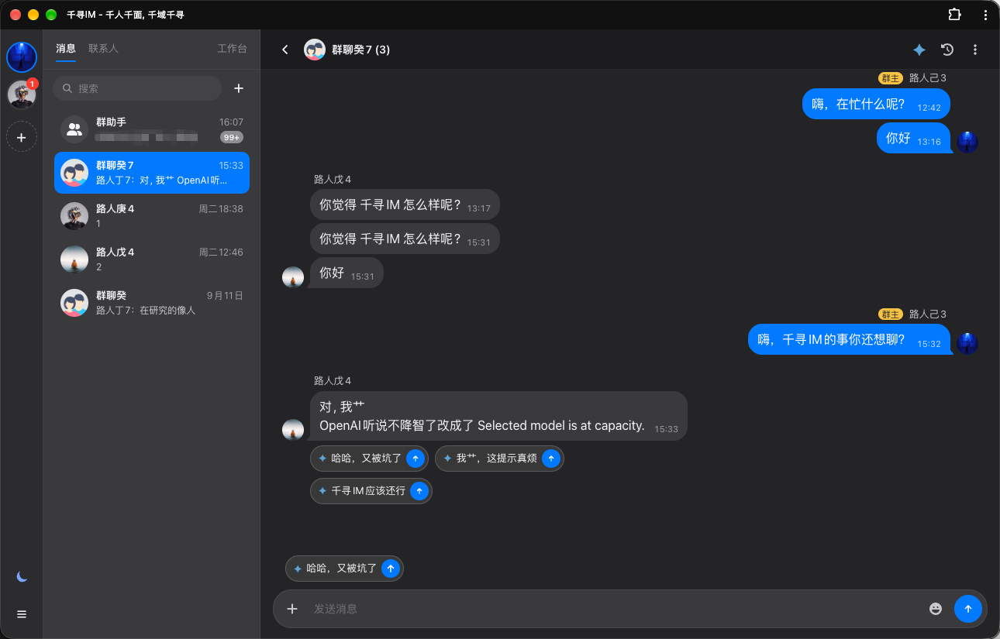
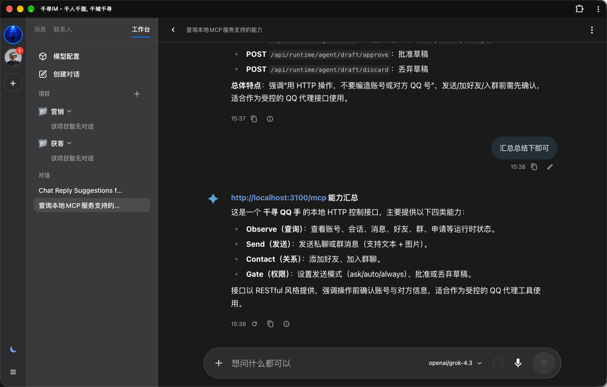
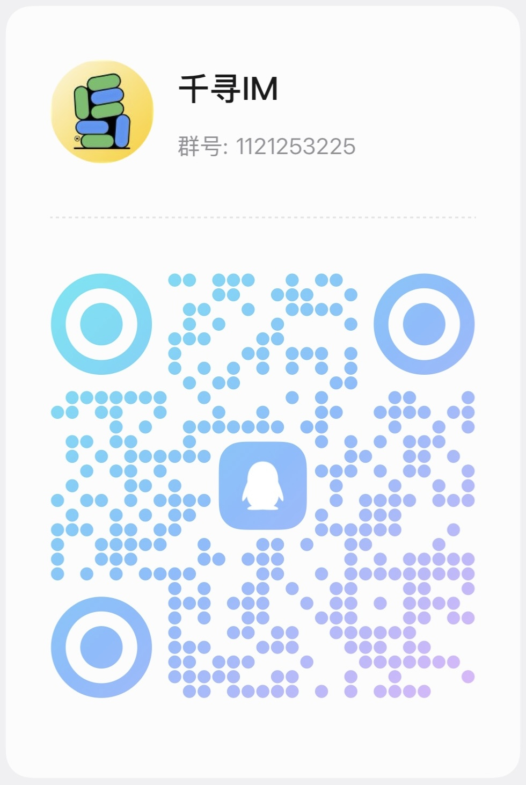

# 千寻 Chihiro

AI IM 工作台。产品仓：[LiberSeek/CHIHIRO](https://github.com/LiberSeek/CHIHIRO)。

一套前端、多账号。IM 是工作现场：人在真实会话里聊天，Agent 在工作台接跨会话任务，Bot 是某个客户会话的接待模式，不是单独产品。

当前开发：**Bot**（客户会话接待）和 **Agent**（操作员工作台）。营销获客、群发、画像评分、多群情报报告后置。

交流 / 反馈：QQ 群 **千寻 IM** `1121253225`，见 [联系我们](#联系我们)。

编码 Agent 先读 [AGENTS.md](AGENTS.md)。产品口径 [docs/product.md](docs/product.md)，工程 [docs/development.md](docs/development.md)。

## 功能预览

消息：多账号、会话列表、群聊与草稿建议。



工作台：与 Agent 对话、MCP 能力、受控发送。



## 现在支持什么

| 能力 | 状态 |
|---|---|
| QQ 扫码 / 快速登录（NapCat + NTQQ） | 支持。Mac 上由 Runtime 拉起隔离的 QQ，不要手跑 `--no-sandbox` |
| 工作台内多账号切换 | 支持。同 peerId 的历史、草稿、未读按账号隔离 |
| 消息 / 联系人 / 聊天 | 支持。统一前端中的 IM 模块，入口 `/im` |
| Agent 工作台 | 支持。ChatUI / Agent 进入同一前端，入口 `/im?tab=workbench` |
| 会话 Bot（问助手 / 草稿 / 接待模式） | 开发中。见 [docs/next-stage-execution-plan.md](docs/next-stage-execution-plan.md) |
| NapCat 设置、AstrBot Dashboard | 支持。Dashboard 只作高级设置 |
| Docker Compose 自托管 | 支持。Linux NapCat 镜像尚未验收 |
| 外部 NapCat（宿主机 QQ） | 支持。macOS 标准路径 |
| Telegram / 飞书 / 钉钉等完整 IM | 未支持。下拉可占位，不表示该平台已有个人号登录和历史 |
| 营销活动、线索评分、跨群报告 | 未作为产品交付。接口与上下文留给 Agent 工具 |

默认打开 http://127.0.0.1:3100/ 就是统一前端。旧壳在 http://127.0.0.1:3100/legacy/ 。以前的 `/next/...` 会 308 到去掉 `/next` 后的路径。

## 功能清单

- **账号栏：** 头像、在线、未读、Bot 角标；`+` 先选客户端再登录；QQ 右键打开 NapCat 设置。
- **消息：** 会话列表、历史、输入、表情、图片预览、转发；联系人单击详情、双击打开会话。
- **工作台：** 操作员与 Agent 对话、选模型、附件；完整 AstrBot Dashboard 在更多菜单里。
- **多账号：** 切换时丢弃迟到响应；移除一个账号不影响其它账号。
- **Gateway：** 浏览器只打 `:3100`。`/api`、`/webui`、`/astrbot`、`/i/:instance` 由网关代理。
- **给外部 Agent 的手：** http://127.0.0.1:3100/mcp ，observe / 草稿闸门 / 受控发送。说明见 [docs/mcp.md](docs/mcp.md)。

## 如何使用

本机（macOS QQ）：

```bash
git clone https://github.com/LiberSeek/CHIHIRO.git
cd CHIHIRO
git submodule update --init vendor/napcat vendor/astrbot
npm install
npm run build:web
npm run dev
```

浏览器打开 http://127.0.0.1:3100/

1. 左侧 **+**，选择 **QQ**，开始登录。
2. 页内扫码。成功后账号 icon 出现在左栏。
3. 中间进消息；切到工作台可与 Agent 说话。
4. Chrome / Edge 可把站点安装成桌面 PWA。Gateway 要一直开着。

停服务：跑 `npm run dev` 的终端里 `Ctrl+C`。QQ 进程若还在，用工作台「退出账号」。

Docker：见 [deploy/README.md](deploy/README.md)。标准 Compose 起千寻 + AstrBot；Mac 上 QQ 仍用外部 NapCat。

若工作台拉不起 QQ，可手动启动后刷新，Runtime 会探测已有登录态（不推荐作为日常路径）：

```bash
'/Applications/QQ.app/Contents/MacOS/QQ' --no-sandbox
```

## 入口

| 路径 | 内容 |
|---|---|
| `/` `/im` `/agent` `/customers` | 统一前端（`frontend/`） |
| `/legacy/` | 旧 `apps/web` 壳 |
| `/next/...` | 308 到对应的根路径 |
| `/webui` `/i/:instance/...` | NapCat |
| `/astrbot` | AstrBot Dashboard |
| `/mcp` | 给 Agent 的操作说明 |
| `/api/status` | 存活检查 |

## 如何开发

日常在 `develop`。发版把 `develop` 合进 `main`。不要在 `main` 上直接改功能。

```bash
npm run check:layout
npm run build:web          # 改 frontend/ 之后
npm run rebuild:im         # 构建 IM 参考插件并安装到本地 NapCat
npm run rebuild:astrbot-ui # 构建 AstrBot ChatUI 参考资源
npm run typecheck:web
npm run test:web
npm run backend:test
npm run status
```

改哪里：

| 要改的 | 目录 |
|---|---|
| 工作台壳、账号栏、路由 | `frontend/` |
| 聊天、输入、表情、历史 | `frontend/src/modules/im` |
| Agent 工作台 | `frontend/src/modules/agent` |
| 账号进程、二维码、发送 | `backend/src/runtime` |
| 反代与静态入口 | `backend/src/gateway` |
| 上游源码对照 | `vendor/stapxs`、`vendor/astrbot`、`vendor/napcat`，均只读 |

`vendor/` 只保存上游源码和版本对照，不是产品功能的日常编辑位置。产品 UI 以 `frontend/src/modules/` 为准，构建脚本可以读取 vendor 生成本地调试资源。不要恢复 `overlays/`，不要把产品功能写进 `vendor/`。token、二维码、`data/`、`config/chihiro.local.json` 不进 Git。

约定：[docs/iteration.md](docs/iteration.md)、[docs/git-workflow.md](docs/git-workflow.md)、[docs/START.md](docs/START.md)。

## 仓库结构

千寻采用 `frontend / backend / deploy` 三层产品结构。`frontend/` 是统一交互入口，`backend/` 提供网关和运行时服务，`deploy/` 负责 Docker 与发布配置。

```text
CHIHIRO/
├── frontend/                 统一产品前端，当前主工作台
│   ├── src/
│   │   ├── app/              应用入口与 AppShell
│   │   ├── modules/
│   │   │   ├── im/           IM 模块
│   │   │   ├── agent/        ChatUI / Agent 模块
│   │   │   ├── assistant/    Bot 建议与会话助手
│   │   │   ├── workspace/    工作区编排
│   │   │   └── customers/    客户相关模块
│   │   ├── contracts/        前后端接口契约
│   │   ├── router/           路由
│   │   ├── services/         API 与业务服务
│   │   ├── stores/           状态管理
│   │   └── styles/           全局样式
│   ├── public/               静态资源
│   └── dist/                 前端构建产物（不提交）
│
├── backend/                  Node 后端
│   ├── src/
│   │   ├── gateway/          :3100 网关、静态资源、反向代理
│   │   ├── runtime/          QQ、NapCat、账号、Agent 生命周期
│   │   ├── mcp/              MCP 服务
│   │   └── core/             核心业务逻辑
│   └── test/                 后端测试
│
├── deploy/                   Docker 与部署配置
│   ├── docker-compose.yml
│   ├── docker-compose.dev.yml
│   ├── docker-compose.external-napcat.yml
│   ├── astrbot.Dockerfile
│   ├── docker-entrypoint.sh
│   └── scripts/
│
├── apps/
│   └── web/                  旧版工作台壳，访问路径为 /legacy
│
├── vendor/
│   ├── stapxs/               Stapxs 参考源码，只读
│   ├── astrbot/              AstrBot 参考源码，只读
│   └── napcat/               NapCat 参考源码，只读
│
├── config/                   默认配置与本地配置模板
├── scripts/                  构建、安装、状态检查脚本
├── docs/                     架构、开发计划、验收文档
│   └── readme/               README 截图与 QQ 群二维码
├── Dockerfile                产品镜像构建入口
├── Makefile                  常用开发与部署命令
├── package.json
├── package-lock.json
├── AGENTS.md
└── README.md
```

本地运行或构建生成的 `data/`、`.cache/`、`dist/`、各级 `node_modules/` 和数据库文件不属于发布源码，不提交到 Git。

## 参考项目

千寻把三件成熟的事先用起来，自己做账号、现场、策略和发送出口。

| 项目 | 在千寻里的角色 | 上游 |
|---|---|---|
| [Stapxs QQ Lite 2.0](https://github.com/Stapxs/Stapxs-QQ-Lite-2.0) | IM 能力与交互参考 | `vendor/stapxs`，只读 |
| [NapCatQQ](https://github.com/NapNeko/NapCatQQ) | QQ 协议 / OneBot / NTQQ | `vendor/napcat`，只读对照 |
| [AstrBot](https://github.com/AstrBotDevs/AstrBot) | 模型、知识库、Agent 循环、ChatUI 能力参考 | `vendor/astrbot`，只读 |
| [OneBot v11](https://github.com/botuniverse/onebot-11) | 消息事件与发信约定 | 经 NapCat 暴露 |

AstrBot 能接某个平台的 Bot 接口，不等于千寻已经提供该平台的完整个人号 IM。

## 联系我们

加 QQ 群 **千寻 IM**（群号 `1121253225`）反馈问题、交流用法。手机 QQ 扫码入群：

<p align="center">
  
</p>
