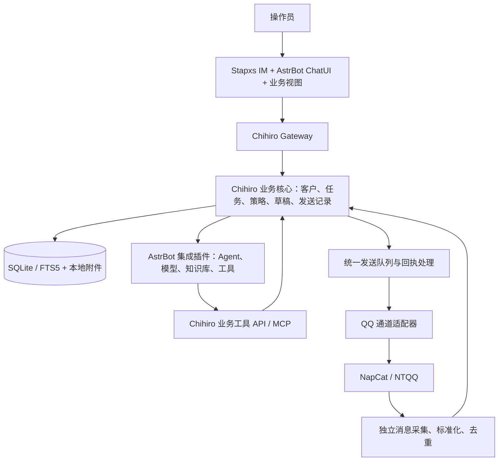

# 千寻 AI IM：营销、客服、运营技术路线（重新评估草案）

日期：2026-09-13。状态：规划提案，未实施。依据：本次产品需求及仓库当前固定版本源码，未核验三个上游在线最新版本。不沿用旧产品文档的“普通聊天为主、Bot 为辅”定位；旧文档暂不覆盖，待新定位确认后统一更新。

## 1. 产品定义与首期边界

千寻是围绕 IM 关系和真实消息，完成客户理解、协同接待、运营洞察、业务触达及结果跟踪的 AI 工作台。IM 是工作现场，AstrBot ChatUI 是操作员给 Agent 下达跨会话任务的入口，Bot 是在指定客户会话中执行接待策略的运行模式。

按 2026-09-14 更新，首期以 Docker 自托管发布、QQ 优先、单操作员使用多账号设计；开发和外部 NapCat 模式保留宿主兼容。团队协作、云端服务、多平台全量 IM 后置，但所有数据提前包含工作空间、账号和操作者身份。AstrBot 支持某平台 Bot 接口，并不表示能提供该平台完整个人账号 IM 登录、联系人、历史消息和发信能力。

产品闭环：消息 → 客户与需求线索 → 业务任务 → 草稿或授权执行 → 真实发送结果 → 回复/跟进 → 运营评估。

## 2. 四个场景的具体实现

### 2.1 客户画像与购买意图

在选定账号、群、时间范围内采集消息。建立客户身份、群成员关系和证据引用；按业务知识提取产品兴趣、明确需求、询价、采购时间、预算（仅有明确依据时）、异议、跟进阶段。事实、人工标签和模型推断分开存储，推断带原文引用、时间、模型/规则版本与可信程度，支持人工修改、过期和刷新。

用规则筛选 + 模型结构化提取生成线索列表，再做人工或显式规则分层。LLM 自评置信度不能视为校准后的购买概率；通过标注样本、后续回复和实际转化验证排序。没有证据时输出未知。

工作流：选数据范围 → 识别候选 → 查看证据 → 建立线索 → 确定联系路径 → 起草沟通 → 跟进。主动添加好友是独立能力闸门：当前找到的 `SetFriendAddRequest` 仅处理收到的申请，没有验证可用的主动加好友通道。第一期支持手动添加/待办和接受申请，不以未经验证的主动加好友接口作为闭环前提。

画像只收集业务必要信息；群聊中的文本是分析资料，不得被当作操作员指令。共享联系人画像时，原始消息和检索权限仍按工作空间、账号、群范围控制。

### 2.2 营销触达与逐人业务沟通

Agent 负责产生受众建议、个性化内容和任务计划；持久化任务执行器负责发信。一次活动保存受众快照、排除名单、账号、内容版本、时间窗、配额、停止条件、授权范围和每个收件人的执行记录。

任务生成后可整体确认一个明确范围，不要求机械地逐条审批；变更受众、账号或内容范围时重新形成可审查版本。支持暂停、取消未执行项目、恢复、去重、失败分类与结果导出。用户拒绝继续联系或正在人工洽谈时，从后续任务排除。

群成员枚举不等于有私聊通道；好友、已建立临时会话、未知联系路径分别标记。NapCat 源码包含临时会话处理，但是否能发取决于 QQ/账号/群的实际状态，必须建立本机能力矩阵。限速用于配额管理和服务稳定性，不承诺绕过平台限制。

某个对象回复后暂停该对象尚未发送的活动消息，转入会话接待策略。发送 API 成功只代表平台接受请求，不等于对方阅读，更不等于业务转化。

### 2.3 多群情报汇总与内容生产

增量采集 → 时间/来源过滤 → 去重和话题聚合 → 分组摘要 → 跨群综合 → 带引用的报告。按消息序号和来源维护采集游标、覆盖范围与缺口，不能把未采集到的时间段当作没有讨论。

首期 SQLite FTS5 处理关键词、用户、群、日期检索；针对中文建立合适分词或验证 trigram 检索。语义检索有明确收益后增加向量索引，索引只是派生数据，引用必须回到原始消息。长历史采用窗口和分层汇总，不把所有群消息塞进一个上下文。

将报告转为选题、提纲、文案草稿；引用群聊素材时提供去身份化处理。外部内容发布是另一个执行动作，不与“生成报告”合并。

### 2.4 会话客服与回复指导

每个会话独立设置：人工、辅助、审核、自动。辅助模式仅在操作员调用时分析或给建议；审核模式在符合触发条件的客户消息到来后自动生成候选并等待确认；自动模式在预先定义的业务、时段和动作范围内执行，其他情况进入待处理。

会话输入框右上角机器人图标打开策略面板；托管后在输入框上方展示工作状态、引用依据、工具执行摘要、候选回复、采用/修改/发送/重新生成及人工接管入口。保留正常输入能力，不以不可编辑的托管提示替换整个输入区。

“发给客户”和“问助手”必须是不同且明确的动作。操作员给 Agent 的内部指示以独立通道提交，不构造假的客户消息混入客户历史。展示处理步骤、事实依据和简洁解释，不依赖模型提供内部思维链。

同会话串行调度，连续短消息合并成一个回复窗口。新消息、操作员开始人工处理、人工发信或策略变更会更新会话版本；待发草稿绑定生成时版本，在实际发送前再次校验。对已提交到平台的消息不能保证取消，界面须区分排队、已提交和未知结果。

## 3. 推荐架构

这是逻辑模块图。第一期采用模块化单体，Node/TypeScript 模块可部署在同一产品进程，任务 worker 可按需要单独运行；AstrBot 保留 Python 进程，NapCat/NTQQ 保留现有运行方式。不为这些模块先增加 Kafka、微服务网格或多套数据库。

根据 2026-09-14 的 Docker 发布方向，产品目录统一为 `frontend/`、`backend/`、`deploy/`。业务服务与存储位于 `backend/src/core`，协议 schema 位于 `backend/contracts`，AstrBot 插件与桥接位于 `backend/integrations/astrbot`；账号/服务管理与 Gateway 分别位于 `backend/src/runtime`、`backend/src/gateway`。详见 `docker-project-layout.md`。这些是目标目录，尚未迁移现有代码。

### 三个上游的职责

| 基座 | 继续复用 | 不承担 |
|---|---|---|
| Stapxs | QQ 消息渲染、联系人、历史 UI、编辑器和 IM 交互 | Agent 推理、任务持久化和业务权限 |
| NapCat | QQ 登录与协议、消息事件、好友/群/历史/发信能力 | 客户画像、营销策略、Agent 规划 |
| AstrBot | 模型 Provider、Agent 工具循环、MCP、知识库、原生 ChatUI 和插件机制 | 千寻 CRM 真相、营销活动状态、人工审核与统一发送授权 |
| Chihiro | 业务对象、数据管线、策略、任务执行、可追踪结果及集成 | 重写上述成熟能力 |

### AstrBot 接入方式

增加千寻集成插件/适配器，通过现有 Agent hooks、工具注册和 Agent runner 接口启动运行并上报事件。已在本地源码确认 `tool_loop_agent`、工具注册、Agent begin/done 与工具开始/完成 hooks；流式输出、取消和无原生 QQ event 的调用方式需要用一条端到端适配原型验证。若需要上下文对象，应创建专用千寻运行上下文/适配事件，而非伪装真实客户消息。

客户消息经 Chihiro 调度进入 AstrBot。操作员任务通过 ChatUI 与同一插件访问千寻工具。AstrBot 对话保留为 AI 对话，业务任务、客户会话、Agent run 明确映射，不混用 sessionId。

受托管业务回复返回 `ReplyProposal` 或向统一发送 API 提交，不让 AstrBot 原生 QQ 适配器与千寻在同一会话中同时自动回复。过渡期可保留 OneBot 桥用于普通插件，并明确隔离哪些会话走哪条路径；业务托管逐步迁移到专用桥。仅有 prompt “请勿发信”不能保证所有插件都遵守，写工具能力由服务端按 run 和策略分配。

MCP 用于 Agent 工具访问，不承担事件总线、持久化任务或人工审批本身。采用官方 SDK 实现 Streamable HTTP；服务端从认证身份与运行记录解析作用域，不信任模型自行提供的任意账号。当前 `/mcp` 返回说明 Markdown，不是可用的 Streamable HTTP MCP 端点，现有手写 stdio framing 也需要按标准 SDK 重做。

### 生命周期

产品运行时只要启用数据采集，就维护 QQ 事件采集，不依赖浏览器开着，也不依赖 Bot 已开启。AstrBot 在有交互运行、托管会话或计划任务时保持可用；关闭一个页面或一个 Bot 开关不能停掉其他任务依赖的进程。浏览器关闭不停止部署中的后台；Compose 服务运行期间计划任务可持续执行。部署主机停机或服务停止后任务暂停，重启恢复策略由持久化执行器负责。

## 4. 数据和契约

业务主存储先用 SQLite WAL + schema migration；多进程写入通过业务服务收口。规模或团队协作确有需要时迁移 PostgreSQL。附件保存在文件系统，记录内容哈希、大小、来源和可用状态。AstrBot 保留其自己的对话/知识库数据库，千寻不直接改写这些表。

| 对象 | 关键内容 |
|---|---|
| Workspace / Account / Actor | 数据范围、渠道身份、操作者 |
| Contact / ChannelIdentity / Membership | 客户、平台 ID、好友关系、所在群；跨平台合并需证据或人工确认 |
| Conversation / Message | 账号、私聊/群、原始 ID、方向、时间、内容段、来源、撤回、引用 |
| Observation / Lead | 业务事实或推断、依据、更新时间、跟进阶段 |
| ConversationPolicy | 模式、触发规则、工作时段、知识范围、动作权限、版本 |
| AgentRun / RunEvent | runId、上下文范围、模型和工具版本、进度、消耗、结果 |
| ReplyProposal / Approval | 候选内容、证据、上下文版本、确认人和确认内容版本 |
| Campaign / TaskItem | 活动、受众快照、每人任务、调度与执行状态 |
| Outbox / Attempt / Receipt | 计划内容、发送尝试、平台消息 ID、错误/未知状态 |
| Report / Feedback / Outcome | 引用、运营产物、人工编辑反馈及实际业务结果 |

消息去重键至少包括工作空间、渠道账号、会话和原始消息 ID；不要把客户端生成的展示 ID 当平台永久标识。采集原始事件与标准化记录，使用平台可得的稳定标识，记录历史覆盖情况。

核心运行契约建议包含 `runId`、`workspaceId`、`accountId`、`conversationId`、`taskId`、`contextVersion`、`policyVersion`、`traceId`。权限范围由服务端运行记录确定。

事件流：`message.ingested`、`run.started`、`tool.started`、`tool.completed`、`reply.proposed`、`approval.requested`、`outbound.accepted`、`outbound.failed`、`conversation.taken_over`。UI 通过 SSE 获取有事件 ID 的增量更新和快照恢复，不反复推送全部账号和完整会话历史。

## 5. 发送执行器是优先基础设施

所有 AI 发信、活动发信和候选回复确认使用同一个服务端出口；逐步让人工发信也走统一命令接口，至少必须第一时间把人工发送归并入消息流并触发接管。

建议状态机：planned → awaiting_approval/queued → sending → accepted/failed/unknown；另有 cancelled 和 superseded。`accepted` 是平台接受请求，不虚构 delivered/read。

实现要点：

- 内容和受众版本在审批时固定，执行前重新验证账号在线、策略、接管状态和会话版本。
- 使用数据库事务和条件更新领取任务、批准草稿，重复点击返回原动作结果。
- Outbox 与业务状态在同一事务中写入，再由 worker 投递。
- 每个会话设置执行锁或租约，活动/客服/人工动作按优先级协调。
- 使用业务幂等键去重；外部 QQ 发信不具有端到端 exactly-once 保证。网络超时进入 unknown，查询可用回执/历史后再处理，不能无条件重发。
- 记录发信 attempt、真实平台消息 ID 和失败分类，取消只作用于尚未提交的动作。
- 未通过授权的工具调用拒绝执行并返回真实原因，不用假的发送成功来安抚 Agent。

## 6. UI 路线

继续保留已明确的“消息 / 联系人 / 工作台”入口：前两者展示客户会话，工作台展示操作员 Agent 对话。ChatUI 单实例双区域接入可以作为当前 UI 基础，但不是业务层架构。

工作台初期复用 AstrBot 原有项目和会话。后续在同一个工作台容器增加任务、待审核、线索、报告的结构化入口；不要把这些对象都伪装成聊天记录。Agent 产生的任务卡片保存 taskId，点击可查看每人进度、修改、暂停和恢复。跨账号任务展示作用账号范围，不能随左侧当前账号切换而悄悄改变执行目标。

当前消息视图增加机器人入口、会话模式指示和托管面板。每次草稿标记针对哪条消息生成、采用了哪些业务知识以及是否因新消息过期。候选可以是简洁回答、补问需求或转人工等不同策略，而不只是多份同义改写。

AstrBot Dashboard 作为高级设置入口保留；业务用户常用的知识范围、客服角色、活动限制逐步进入千寻业务表单，并通过 AstrBot API 配置其对应能力。

## 7. 当前代码如何取舍

保留：QQ 账号/进程管理、Gateway 单入口、Stapxs User* IM、原生 ChatUI 复用、NapCat 历史桥接、现有草稿面板的交互基础。

改造重点（均来自本地源码检查）：

1. `apps/runtime/src/agent.mjs` 的 `fakeOk()` 对被拦截消息返回虚构成功；`decideOutbound()` 在实际发送回执前标为 replied。需要真实 proposal/attempt/receipt 状态。
2. `approveDraft()` 先读 pending 再发送、没有事务领取，重复或并发审批存在重复发送窗口；进入统一执行器。
3. `agent-store.mjs` 使用同步 JSON 全量读写且仅保留最近 120 条会话流水；不能作为消息分析和业务历史库。
4. 当前 `ask/auto/always` 主要按链接、图片、@全体决定是否拦截，不能表达客服业务权限或活动范围；改成会话策略和动作策略。
5. 操作员指导通过模拟 OneBot 客户事件提交，内部指令与客户原话没有清晰通道；改成专用运行请求。
6. 当前只有部分 send actions 经过拦截，其他修改动作透传，不能视为统一授权系统。
7. `bot.mjs` 用 Bot 开关决定是否停 AstrBot，无法覆盖 ChatUI、托管、计划任务等并存需求；引入运行需求登记或租约。
8. `apps/web/mcp.md` 与当前工具文案包含“不要加好友”等旧边界；新能力验证后更新工具与服务端策略，不靠改提示词获得实际能力。

## 8. 分阶段路线与验收门槛

| 阶段 | 交付 | 进入下一阶段的门槛 |
|---|---|---|
| P0：能力与契约原型 | QQ 能力矩阵；单会话的 Chihiro → AstrBot → 结构化草稿 → UI；来源映射与取消实验 | 好友/临时会话/历史接口已实测；run 与会话可关联；不伪造客户消息或发信成功 |
| P1：消息与执行基础 | SQLite、增量采集、历史回填、身份映射、策略、run 记录、outbox、事件流、SDK MCP | 浏览器关闭仍采集；断线恢复去重；重复审批只创建一次动作；超时保留 unknown |
| P2：客服辅助闭环 | 机器人入口、知识库检索、手动问助手、候选生成与编辑、审批、接管 | 人工发言/新消息使旧草稿失效；证据可跳转；一会话并发回复受控；生成与真实发信状态一致 |
| P3：受限自动客服 + 群情报 | 会话触发与自动模式；跨群检索、定时报表、引用和内容草稿 | 无依据问题可转人工；日志可追踪；报告有覆盖范围和引用；产品后台重启恢复任务 |
| P4：画像、线索与跟进 | 证据画像、线索排序、人工校正、跟进提醒、结果反馈 | 标注集评估排序质量；跨群身份合并准确；线索与原消息及跟进结果关联 |
| P5：营销活动 | 受众快照、个性化草稿、活动确认、分批执行、暂停恢复、回复转接待 | 拒绝名单/账号配额/重复触达控制有效；部分失败可恢复；回复后的旧营销任务停止 |
| P6：团队与多平台 | RBAC、任务分配、共享知识/客户、PostgreSQL（需要时）、新通道 | 每个平台单独完成登录、收信、历史、发信、身份与权限验收，不按 AstrBot 适配器数量宣称完整支持 |

P3 中的只读群情报可在 P1 后提前开展；营销不应跳过发送执行基础和会话接管。首个垂直闭环优先客服辅助：它能共同验证采集、检索、Agent、草稿、发送和反馈，且最快积累可评估的业务样本。

不承诺未经试点的完成日期。P0 后按已验证 API、插件接入成本和现有消息量拆分可验收任务，再给出迭代估算。每阶段先用单账号、有限会话进行影子运行/草稿验证，再扩大自动执行范围。

## 9. 评估与运行成本

客服：草稿采纳率、编辑幅度、首次响应时间、正确回答率、转人工率、误发和重复发送。画像：人工标注准确率、线索前 N 名有效率、过期率。情报：引用正确率、覆盖完整度和节省时间。营销：平台接受率、有效回复率、拒绝率、人工记录的商机/成交，而非只看发出数量。

先积累脱敏且有代表性的离线评测样本，再改 prompt、检索和模型。人工采用/编辑是反馈信号，不能未经筛选自动当作正确答案写回知识库。

成本按账号/任务/模型统计；使用消息合并、规则预筛、缓存、增量摘要、检索和运行预算控制。客户实时接待优先于后台报告和批量分析。上线前验证断线、重连、进程重启、重复事件、模型超时、人工接管和账号切换。

产品保留数据范围、保留期和删除能力；客户内容不能授权工具提升权限。授权和停止规则直接体现业务可控性，不依赖模型自行判断是否应该执行。
