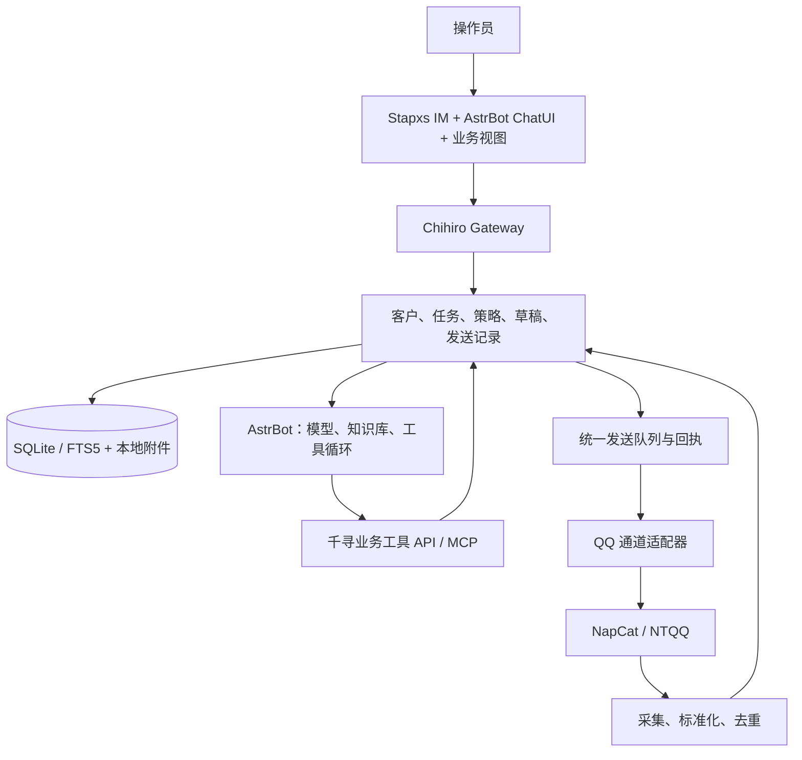

# 千寻开发

产品口径只在 [product.md](product.md)。本文是工程：目录、职责、契约、发送出口和阶段。当前冲刺是 Bot 与 Agent，见 [next-stage-execution-plan.md](next-stage-execution-plan.md)。

前端抽取细节见 [frontend-unification-plan.md](frontend-unification-plan.md)。目录与 Compose 边界见 [docker-project-layout.md](docker-project-layout.md)。日常改文件规则见 [iteration.md](iteration.md)。当前冲刺见 [next-stage-execution-plan.md](next-stage-execution-plan.md)。

2026-09 的原文和执行台账在 [archive/](archive/)。

## 1. 目标与约束

交付一个完整产品：`frontend/` 是唯一 Vue 前端，`backend/` 是模块化 Node 后端，`deploy/` 管镜像和 Compose。Stapxs IM、AstrBot ChatUI、会话助手是同一前端里的模块。AstrBot Python 与 NapCat/NTQQ 仍是后端能力，不揉成一个进程。

用户只接触一个 Gateway 地址。主界面不再由 iframe、动态 ChatUI IIFE 或跨应用 postMessage 拼起来。账号、会话、Agent、任务、助手状态由统一前端显式管理。

- 遵守根 `AGENTS.md`：Stapxs / AstrBot `User*` 边界、NapCat 只读、禁止 overlays、敏感数据不入仓。
- 默认入口是 `frontend/` 构建产物，Gateway 挂在 `/`。旧壳 `apps/web` 只在 `/legacy`。`/next` 308 到去掉前缀后的路径。
- 第一期模块化单体：Node 模块可同进程，任务 worker 可按需分开。不为这些模块先加 Kafka、网格或多套数据库。
- 营销、客服、情报不做成第二套业务引擎；千寻提供上下文和发送出口，Agent 用工具与工作流承载。

## 2. 终态目录

```text
frontend/                         唯一产品前端（一个 createApp / Pinia / Router）
  src/app/                        AppShell、providers、bootstrap
  src/router/
  src/stores/
  src/api/
  src/components/
  src/modules/im/                 Stapxs 派生
  src/modules/agent/              AstrBot ChatUI 派生
  src/modules/assistant/          会话辅助与托管
  src/features/                   客户、线索、任务、报告（Agent 可调用的上下文，不是独立 CRM）
backend/
  src/gateway/                    静态服务、API、鉴权、SSE/WS 代理
  src/runtime/                    账号与外部服务生命周期
  src/core/                       客户、消息、策略、任务、发送队列
  src/connectors/                 QQ/NapCat 及其他通道
  integrations/astrbot/           插件和桥接
  contracts/
  migrations/ / tests/
deploy/                           Compose、镜像、环境样例
vendor/                           上游来源和对照
```

`apps/web` 只作为 `/legacy` 回退壳，不再是默认入口。

## 3. 逻辑架构



| 基座 | 继续复用 | 不承担 |
|---|---|---|
| Stapxs | 消息渲染、联系人、历史 UI、编辑器 | Agent 推理、任务持久化、业务权限 |
| NapCat | QQ 登录与协议、事件、好友/群/历史/发信 | 画像、营销策略、Agent 规划 |
| AstrBot | Provider、工具循环、MCP、知识库、ChatUI、插件 | 客户真相、活动状态、人工审核、统一发送授权 |
| 千寻 | 业务对象、管线、策略、执行、可追踪结果、集成 | 重写上述成熟能力 |

## 4. AstrBot、MCP、生命周期

千寻集成插件经现有 Agent hooks、工具注册和 runner 启动并上报事件。需要上下文时创建专用运行上下文，不伪装真实客户消息。

客户消息由千寻调度进 AstrBot。操作员任务走 ChatUI 与同一插件。AstrBot 对话仍是 AI 对话；业务任务、客户会话、Agent run 明确映射，不混用 sessionId。

受托管回复返回 `ReplyProposal` 或打统一发送 API。同一会话里，AstrBot 原生 QQ 适配器不得与千寻同时自动回复。过渡期 OneBot 桥只给普通插件，并隔离路径。写工具能力由服务端按 run 和策略分配；prompt「请勿发信」不算授权。

MCP 只做 Agent 工具访问，不当事件总线、持久化任务或审批通道。用官方 SDK 做 Streamable HTTP；作用域从认证身份和运行记录解析，不信任模型自报账号。当前 `/mcp` 若仍返回说明 Markdown，不能当成可用 MCP 端点。

只要启用数据采集，就维护 QQ 事件采集，不依赖浏览器，不依赖 Bot 开关。AstrBot 在有交互运行、托管会话或计划任务时保持可用；关一个页面或一个开关不能停掉其他任务仍需要的进程。Compose 运行期间计划任务可继续；主机停机后由持久化执行器恢复。

## 5. 数据与契约

业务主存储先用 SQLite WAL + migration；多进程写入收口到业务服务。确有需要再迁 PostgreSQL。附件在文件系统，记录哈希、大小、来源和可用状态。不直接改写 AstrBot 自己的对话/知识库表。

| 对象 | 关键内容 |
|---|---|
| Workspace / Account / Actor | 数据范围、渠道身份、操作者 |
| Contact / ChannelIdentity / Membership | 客户、平台 ID、好友关系、所在群；跨平台合并需证据或人工确认 |
| Conversation / Message | 账号、私聊/群、原始 ID、方向、时间、内容段、来源、撤回、引用 |
| Observation / Lead | 事实或推断、依据、更新时间、跟进阶段 |
| ConversationPolicy | 模式、触发、时段、知识范围、动作权限、版本 |
| AgentRun / RunEvent | runId、范围、模型/工具版本、进度、消耗、结果 |
| ReplyProposal / Approval | 候选、证据、上下文版本、确认人和确认时版本 |
| Campaign / TaskItem | 活动、受众快照、每人任务、调度与执行状态 |
| Outbox / Attempt / Receipt | 计划内容、发送尝试、平台消息 ID、错误/未知 |
| Report / Feedback / Outcome | 引用、产物、人工反馈、实际结果 |

消息去重键至少包括工作空间、渠道账号、会话和原始消息 ID。不要把客户端展示 ID 当平台永久标识。记录历史覆盖情况。

运行契约：`runId`、`workspaceId`、`accountId`、`conversationId`、`taskId`、`contextVersion`、`policyVersion`、`traceId`。权限由服务端运行记录决定。

事件：`message.ingested`、`run.started`、`tool.started`、`tool.completed`、`reply.proposed`、`approval.requested`、`outbound.accepted`、`outbound.failed`、`conversation.taken_over`。UI 用带事件 ID 的 SSE 增量 + 快照恢复，不反复推全量账号和完整历史。

前端契约还包括 `AccountContext`、`ConversationKey`、`AgentSessionRef`、`OutboundAction`。客户会话 ID 与 Agent 会话 ID 不同类型，通过明确上下文关联。

## 6. 发送执行器

所有 AI 发信、活动发信、候选确认走同一出口。逐步让人工发信也走统一命令；至少立刻归并进消息流并触发接管。

状态机：`planned` → `awaiting_approval` / `queued` → `sending` → `accepted` / `failed` / `unknown`；另有 `cancelled`、`superseded`。`accepted` 是平台接受请求，不虚构 delivered/read。

- 审批时固定内容和受众版本；执行前再验账号在线、策略、接管、会话版本。
- 事务 + 条件更新领取任务和批准草稿；重复点击返回原动作结果。
- Outbox 与业务状态同一事务写入，再由 worker 投递。
- 每会话执行锁或租约；活动 / 客服 / 人工按优先级协调。
- 业务幂等键去重。外部 QQ 没有端到端 exactly-once。超时进 `unknown`，查回执/历史后再处理，不能无条件重发。
- 记录 attempt、真实平台消息 ID、失败分类。取消只作用于尚未提交的动作。
- 未授权工具调用拒绝并返回真实原因，不用假成功安抚 Agent。

前端不能单凭模型生成完成把回复标成已发送。

## 7. 已知实现债

改造时对照，不要倒退：

1. 拦截路径不得 `fakeOk()`；回执前不得标为已回复。用 proposal / attempt / receipt。
2. 批准草稿必须条件领取，关闭重复/并发双发窗口。
3. 同步 JSON 全量读写、只留最近几十上百条流水，不能当消息分析和业务历史库。
4. `ask` / `auto` / `always` 若只按链接、图片、@全体拦截，不能表达业务权限；改为会话策略和动作策略。
5. 操作员指导不得模拟成 OneBot 客户事件。
6. 只有部分 send action 进拦截，不算统一授权；其它修改动作默认透传是漏洞。
7. 用单个 Bot 开关决定是否停 AstrBot，覆盖不了 ChatUI、托管、计划任务并存；改运行需求登记或租约。
8. 工具能力以服务端策略为准，不靠改 MCP 提示词获得实际能力。主动加好友等未验证接口只提供待办。

保留：QQ 账号/进程管理、Gateway 单入口、Stapxs User* IM、原生 ChatUI、NapCat 历史桥、现有草稿面板交互基础。

## 8. 阶段

营销不得跳过发送基础和会话接管。只读群情报可在采集稳定后提前做。每阶段先单账号、有限会话影子运行，再扩大自动执行。不承诺未经试点的完成日期。

| 阶段 | 交付 | 进入下一阶段 |
|---|---|---|
| 当前：Bot 与 Agent | 会话策略、问助手、候选、审批、接管；工作台 Agent 用千寻工具；统一发送出口 | 人/助手/Bot 通道分开；草稿与发信状态为真；关页面不停其它任务 |
| 消息与执行基础 | SQLite、增量采集、历史回填、身份映射、run、outbox、事件流、SDK MCP | 浏览器关闭仍采集；断线恢复去重；重复审批只一次动作；超时保留 unknown |
| 受限自动 + 群情报 | 会话触发与自动模式；跨群检索、定时报表、引用和内容草稿 | 无依据转人工；报告有覆盖范围和引用；重启恢复任务 |
| 画像与线索 | 证据画像、排序、人工校正、跟进、结果反馈 | 标注集评估排序；跨群身份合并有证据；线索连得回原消息 |
| 营销活动 | 受众快照、个性化草稿、确认、分批、暂停恢复、回复转接待 | 拒绝名单/配额/去重有效；部分失败可恢复；回复后停该人后续营销 |
| 团队与多平台 | RBAC、任务分配、共享知识/客户、需要时 PostgreSQL、新通道 | 每平台单独验收登录、收信、历史、发信、身份与权限 |

统一前端已挂在 `/`。后续阶段细节见 [frontend-unification-plan.md](frontend-unification-plan.md)。旧工作台验收清单只留在 [archive/0.1.0-acceptance.md](archive/0.1.0-acceptance.md)，不再当冲刺目标。

## 9. 测试、评估、运行

每个阶段：类型/单元测试、构建检查、`git diff --check`。多账号时序、Agent SSE/WS、审批幂等和发送状态机、Docker 健康/数据卷/重启回退按阶段加上。Agent/Monaco/大型渲染器按路由懒加载。

上线前验证断线、重连、进程重启、重复事件、模型超时、人工接管和账号切换。客户实时接待优先于后台报告和批量分析。成本按账号/任务/模型统计；用消息合并、规则预筛、缓存、增量摘要、检索和运行预算控制。

客服看草稿采纳率、编辑幅度、首次响应、正确率、转人工、误发和重复发送。画像看标注准确率、线索前 N 有效率、过期率。情报看引用正确率和覆盖。营销看平台接受率、有效回复、拒绝、人工记录的商机，不只看发出数量。

先积累脱敏评测样本再改 prompt/检索/模型。人工采用/编辑是反馈，不能未经筛选写回知识库。产品保留数据范围、保留期和删除；客户内容不能让工具提升权限。
